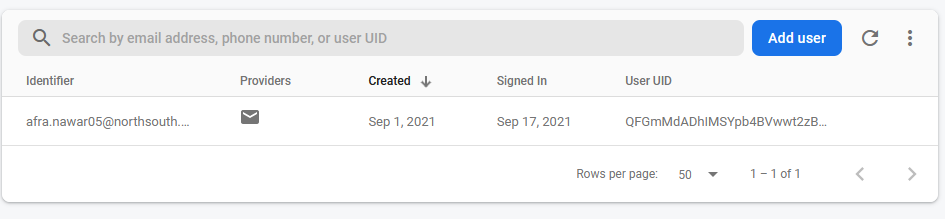
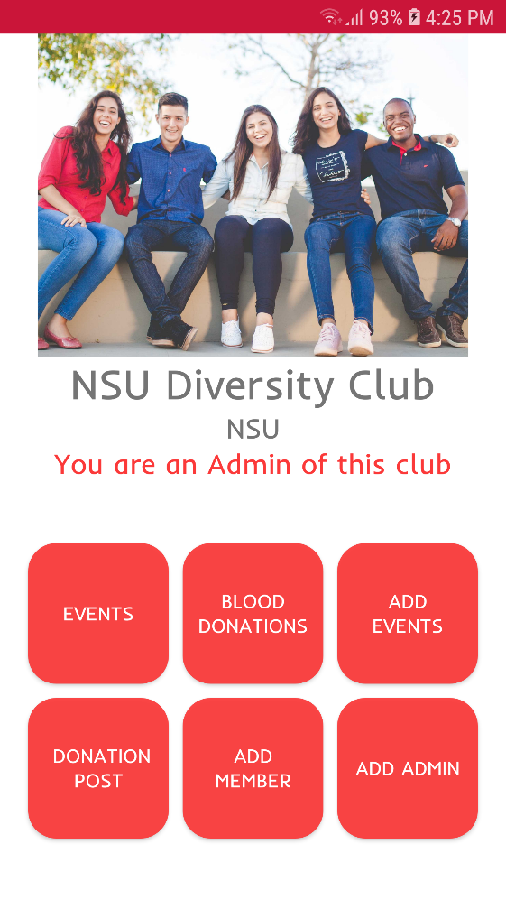
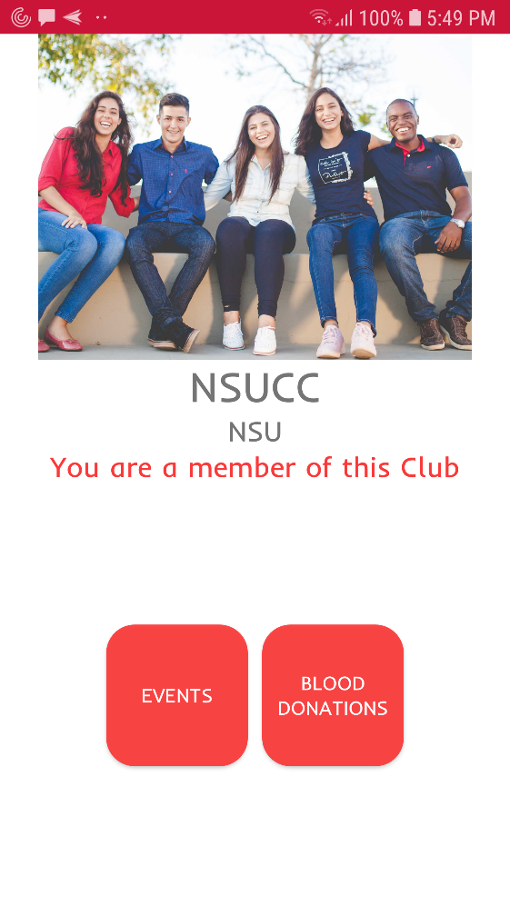
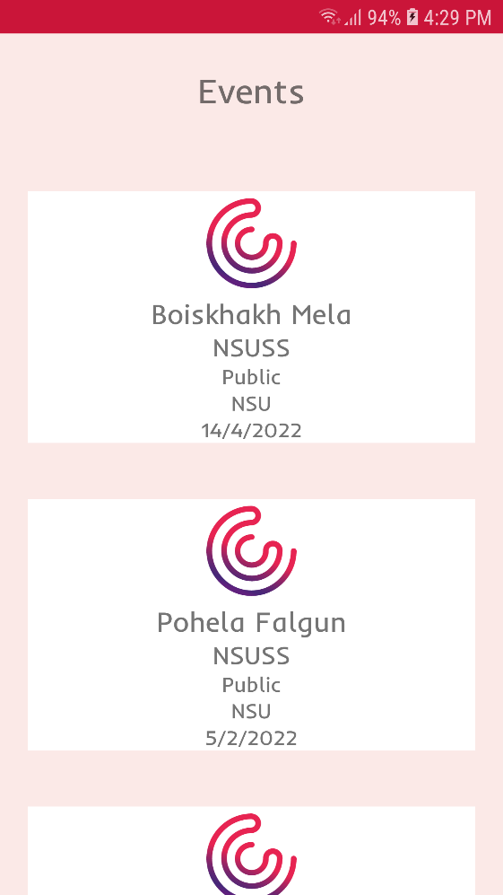

**North South University**

Department of Electrical & Computer Engineering

**Final Project Report**

**Summer 2021**

**Course Name**: Mobile and Wireless Application Development

**Course No**: CSE 486 **Sec:** 01

**Faculty**: Shaikh Shawon Arefin Shimon (SAS3)

**Member 1**:

**Name:** Afra Nawar

**ID: ** 1812048042

**Email:** <afra.nawar05@northsouth.edu>

**Git Repository:**
<https://github.com/NSU-SU21-CSE486-1/1812048_SU21_CSE486_1>

**Date Submitted:** September 18th

# Table of Contents

[Introduction 3](#introduction)

[Features 3](#features)

[Backend 4](#backend)

[User Authentication 5](#user-authentication)

[Database 5](#database)

[Front End 7](#front-end)

[General Screens 7](#general-screens)

[Profile 9](#_Toc82825425)

[Club 10](#club)

[Events 11](#events)

[Blood Donation 12](#blood-donation)

[Roadblocks and Challenges 12](#roadblocks-and-challenges)

[Firebase Database Integration 12](#firebase-database-integration)

[Responsive UI 13](#responsive-ui)

[Architecture 13](#architecture)

[Open Ended Questions 13](#open-ended-questions)

UniClubz

One Stop Club Portal for All Bangladeshi Students

# Introduction

One of the primary features of anu university is the plethora of clubs
it features. These are where the social lives of thousands of its
students thrive. At present in Bangladesh, these clubs are run and
moderated on club rooms while in campus and in Facebook groups when
off-campus. However, in this pandemic, the club activities have been
solely limited to Facebook. This has created an unnecessary dependency
on Facebook and made clubs more impersonal and made the logistics of
events and communication inefficient.

In case of an event a post is made multiple times on the TimeLine, but
these get lost alongside regular posts. In case of Blood Donation posts,
we observe the same situation. The club admins are not properly set and
there is lack of regulation of members. Therefore, a centralized system
for club management has become highly necessary.

UniClubz is an application catered towards solving this problem. It is
an end-to-end club management and communication portal for universities
all over Bangladesh. Any student can register and find clubs in their
universities and request to join. Admins can easily add events,
donations and add other members and admins. As a result, club management
will be simpler, more efficient and enjoyable, particularly in this
pandemic.

# Features

The Use Cases of UniClubz can be summed up as follows:

1.  App User:

    1.  Sign Up as a user

    2.  Login and Logout from the app

    3.  Add Basic Information for Profile

    4.  Add University Affiliations with Student ID, email and other
        information

    5.  Add Contact Information such as email and phone numbers

    6.  View All Clubs in their universities

    7.  Request to join clubs

    8.  View all clubs they are a member of

    9.  See events in their universities and clubs

    10. See blood donation posts in their universities and clubs

    11. Attend an event

    12. Accept a Blood Donation post

    13. Create New Clubs

2.  Club Admins:

    1.  View All Clubs they are Admin of

    2.  Accept members to Club

    3.  Make Donation posts

    4.  Make Event Posts

    5.  Add another Admin

    6.  Add a member manually

    7.  Review Donations Acceptance

    8.  Review Event Attendance

# Backend

UniClubz is created an android application written in Java, making it a
native application for Android phones. The Model View ViewModel (MVVM)
Architecture was used in the app which facilitates the separation of the
development of the UI from the business logic of the application. The
Architecture is shown in figure below.

## User Authentication

Firebase authentication is used to authenticate users. Users are able to
sign up in the Sign-Up activity which sends the data to the Firebase
Authentication portal for the UniClubz app and creates a new user. Users
can login to the app using their credentials and logout of the app. Once
logged in, they are logged in even after closing and opening the app
again.

Fig: Authentication Portal of Firebase Showing registered users

## Database

UniClubz utilizes the Firebase Realtime Database to store data on the
Backend in real-time. It is a NoSQL database where the data is a
collection of keys and value pairs structured hierarchically. An example
database transaction includes when a new club is created it is added
under the club’s collection, and the club id is added under the user who
is its admin. Same way when members are added it is added to their club
list. Similar transactions take place when events and blood donations
are created and also when user accepts donation or attends events.

Fig: Donations in the Realtime Database

# Front End

The Front End of the Application was at first designed using Figma. The
designs were then transformed into the UI of UniClubz app using
Android’s native way of designing UI with XML. Ease of use was taken
into account when designing the UI for best user experience. Some of the
screens are shown below:

## General Screens

## Profile

## Club 

## Events

## Blood Donation

# Roadblocks and Challenges

During the development of the UniClubz app, multiple challenges were
faced, many of which were overcome after intensive hours. Some of the
most challenging difficulties included:

## Firebase Database Integration

Firebase is a NoSQL database, and NSU’s database management courses
focus exclusively on RDBMS, therefore I had to learn the usage of
Firebase Realtime database in a very short time. Furthermore, there was
a lack of extensive documentation regarding its usage and there were not
many forum posts either.

It was very difficult to retrieve data from Firebase as the process is
not straightforward. It required nested listeners and very complicated
code to get the data in the proper format. However, it was solved and
implemented

Data is retrieved asynchronously, which was another problem as the data
was not loaded into UI properly when UI initialized. This issue was
solved using handlers and runnable to wait for data to be retrieved
first and then the adapters in UI to be loaded.

The structuring of data was also complicated. It was kept flat according
to the best practice of NoSQL DB design. Lots of bugs were encountered
and fixed when pushing and retrieving data to Firebase

## 

## Responsive UI

UniClubz was aimed to be responsive so that the UI is functional in many
different phone screens. Therefore, Constraint Layout was used
extensively and absolute values in UI components’ dimensions were
avoided.

## Architecture

There was difficulty in implementing the MVVM architecture as it more
code to be written and multiple classes to be constructed. However,
after it was implemented, that code was cleaner and more manageable.

# Open Ended Questions

*1. How do you generate automatic email?*

It is possible to set database triggers on Firebase databases to perform
certain actions when a database transaction occurs. Firebase has an
extension that sends automatic email with specified trigger. However, it
needs a paid plan to activate. Details are available at:
https://firebase.google.com/products/extensions/firestore-send-email

*2. How do you handle authentication?*

Authentication is handled using Firebase Authentication. It handles user
registration, logging in and logging out.

*3. How do you generate unique ID?*

There is a push().getkey() function we can call on a
DatabaseReferenceobject which automatically generates a unique random
key. These random keys were used for all IDs in this app.

*4. How do you handle screen rotation?*

The attribute android:screenOrientation="portrait" was used on
activities which would not render properly in landscape orientation. As
the app was made to be used mostly in portrait mode.

*5. Which firebase database should be used?*

Firebase Realtime database was used in the app. The Firestore database
could also have been used as they follow similar logic. However, the
real-time database is older and has more documentation and forum help
posts. Firestore database is also comparatively complex for first time
NoSQL users.
